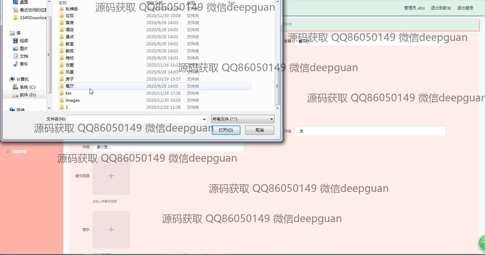
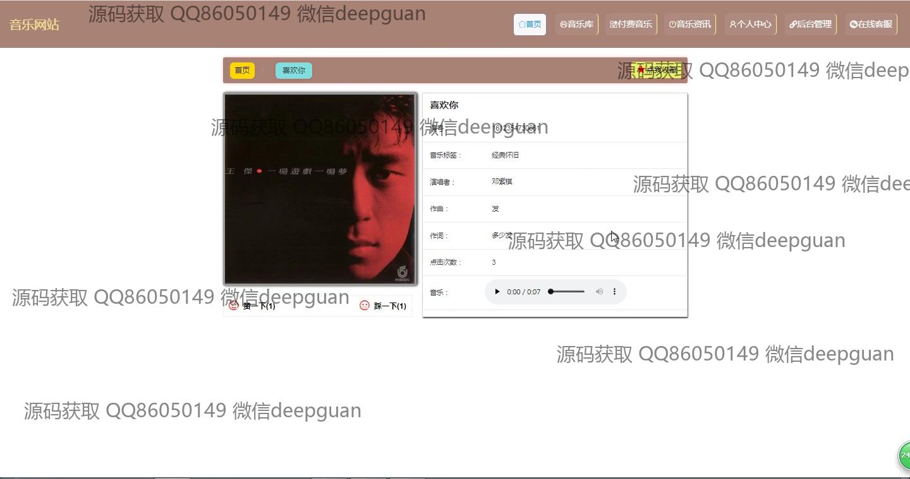

<h1 align="center">的音乐网站-付费管理系统vue前端</h1>

## 简介
音乐网站付费管理系统：角色分为管理员、用户；提供用户信息管理、音乐内容管理、付费信息管理、订单管理、在线支付、歌曲播放及评论功能。    --计算机毕业设计源码；毕设源码；java毕业设计源码

## 联系方式

<h3 align="center">获取完整代码与数据库文件 + 微信：deepguan QQ: 86050149 QQ群: 783742310</h3>

<h3 align="center">可帮忙远程部署 包运行成功！提供远程部署、修改代码、设计文档指导、代码讲解等服务！</h3>

## 功能介绍（完整见运行截图）
管理员：登录和注册，用户管理，音乐和歌曲管理，订单管理，支付及系统管理。管理页面包括上传和管理音乐视频音频、设置定价、以及处理订单审核。支持歌手和用户信息的查看编辑，提供即时客服支持。用户：注册和登录，访问个性化音乐库、付费音乐、及音乐资讯。通过个人中心可以更新个人信息，管理订单和收藏。用户也可通过多种支付方式完成在线音乐购买。在主界面查看和评论音乐，使用内置播放器控制音乐播放。

## 运行截图

本代码来源于网络,仅供学习参考使用!

